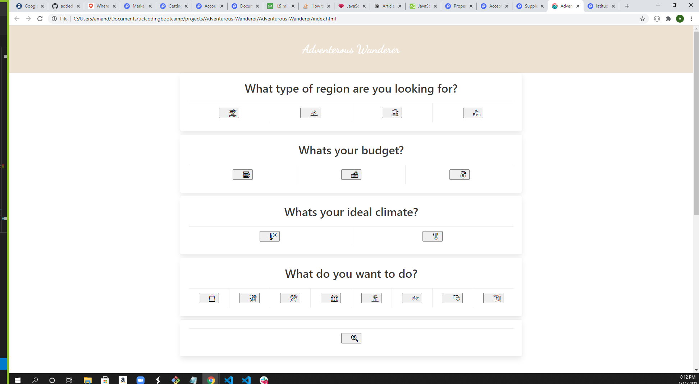
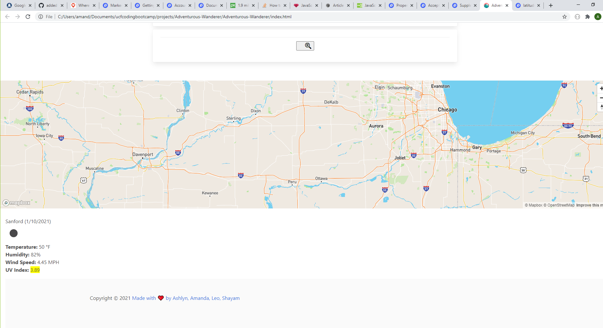

## Advanturous-wanderer-project-1
A user friendly, web application to pick out a randomized cities anywhere in the world based on the user's answers to a set of questions with criterias: region, budget, climate and activites.

## User scenario
`As a user, i get to choose to my ideal travel destination base on my preference choices of region, budget, climate and activities`

## Application content

This application will utilize API from 3 sources: empty, empty, openweather.com to show the users their desired travel destinations.
 

#### Demo

